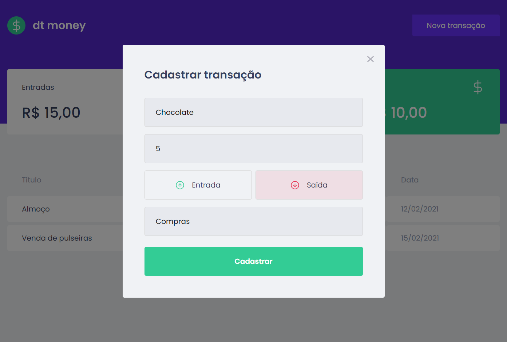

# dt money

## Sobre o Projeto:
dt money é um projeto de gerenciamento de finanças pessoais.
Com ele é possível visualizar os gastos mensais, listagem das despesas, data da compra, valor, categoria e também as entradas, saídas e saldo.
Projeto desenvolvido no capítulo 2 do curso Ignite 2021 - Trilha ReactJS, disponibilizado pela Rocketseat.

## Tecnologias:

 - TypeScript
 - Styled Components
 - MirageJS
 - Axios
## Como executar
Clone o projeto e acesse a pasta do mesmo.

- $ git clone https://github.com/brunafinSD/ignite-chapterII.git
- $ cd ignite-chapterII

Para iniciá-lo, siga os passos abaixo:

## Instalar as dependências
$ yarn

## Iniciar o projeto
- $ yarn start
- A aplicação estará disponível no seu browser pelo endereço http://localhost:3000

## Imagem

